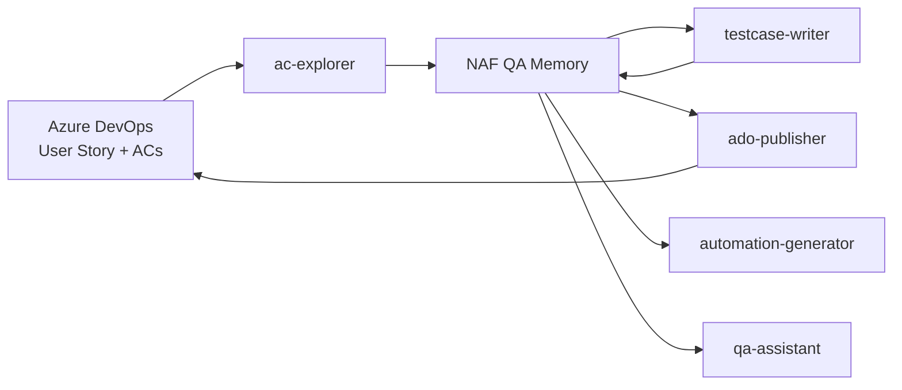

# QA Testing Agents

Cursor agents for the NAF Link QA workflow: explore acceptance criteria in the browser, write manual test cases, publish them to Azure DevOps, and generate Playwright automation. All agents share exploration data through **NAF QA Memory** so downstream steps use real UI steps and locators—not guesses.

**Build-out:** [../docs/build-out/README.md](../docs/build-out/README.md) — implementation tasks for another agent.  
**Platform architecture:** [../docs/architecture/qa-agent-platform.md](../docs/architecture/qa-agent-platform.md)  
**E2E code target:** `c:\Projects\greenfield-e2e\` (Profile B greenfield .NET) — not this repo.  
**Automation profile:** `automation-generator` targets Profile A (NAFLink) today; Profile B may require hand-authored tests or agent update — see [../docs/decisions/ADR-001-automation-profiles.md](../docs/decisions/ADR-001-automation-profiles.md).

**Reference:** [AgentHelper.docx](https://naf365-my.sharepoint.com/:w:/r/personal/monique_thibodeaux_nafinc_com/_layouts/15/Doc.aspx?sourcedoc=%7B266EA0C3-B7F6-4964-AE9B-E9B9FD23BAD7%7D&file=AgentHelper.docx&action=default&mobileredirect=true)

---

## Pipeline overview



| Step | Agent | What it does |
|------|-------|--------------|
| 1 | **ac-explorer** | Reads ACs from ADO, walks the app in the browser, captures steps and locators |
| 2 | **testcase-writer** | Turns exploration data into ADO-format manual test cases (one TC per AC) |
| 3 | **ado-publisher** | Creates Test Case work items in ADO and links them to the user story |
| 4 | **automation-generator** | Generates NUnit + Playwright C# tests from exploration or executed TC data |
| — | **qa-assistant** | Read-only lookup: memory, codebase, or ADO—answers status and locator questions |

---

## Agents

### `ac-explorer`

**Role:** Browser explorer. Bridges written acceptance criteria and real application behavior.

**When to use:** Starting work on a user story, capturing workflow/locators, or executing existing ADO test cases in the browser.

**Invoke:** `@ac-explorer 471244` or “explore ACs for US 471244”

**Modes:**
- **AC exploration** — Walk each acceptance criterion in order on `https://qa.ll.nafinc.com`
- **TC execution** — Run steps from linked ADO test cases and record pass/fail
- **Both** — Execute TCs first, then explore any uncovered ACs

**Stores in memory:**
- `US_{ID}_AC{N}` — Per-AC steps, locators, status (PASS/FAIL/BLOCKED)
- `US_{ID}_TC{TestCaseID}` — Per-TC execution results (when running existing TCs)
- `US_{ID}_Summary` — Overall exploration summary and locator catalog

**Rules:** AC-only actions (no exploratory detours), credentials from NAF QA Memory, stop and ask on first failure—no retries.

---

### `testcase-writer`

**Role:** Manual test case author. Writes ADO Test Case documents from exploration data.

**When to use:** After `ac-explorer` has stored data for a user story.

**Invoke:** `@testcase-writer US 471244` or “write test cases for AC2 of 471244”

**Output:** One test case per AC in ADO format—happy path, negative, and edge scenarios as numbered steps within a single TC. Every TC starts from login (PingOne SSO).

**Rules:** No browser access, no invented steps—only data from memory. Uses sequential thinking to plan coverage before writing.

**Requires:** `ac-explorer` data in memory (`US_{ID}_AC{N}` entities).

---

### `ado-publisher`

**Role:** Publishes manual test cases to Azure DevOps as Test Case work items.

**When to use:** After `testcase-writer` has produced finalized test cases.

**Invoke:** `@ado-publisher publish test cases for US 471244`

**Actions:**
- Creates Test Case work items with Action + Expected Result steps
- Links each TC to the parent user story
- Stores created TC IDs back in memory for `automation-generator`

**Rules:** Publishes steps exactly as written—no rewrites. Confirms with user before creating work items. Skips duplicates if TCs already linked.

**Requires:** Test case data from `testcase-writer` in memory.

---

### `automation-generator`

**Role:** Test automation architect for the NAFLink UI Test Automation framework (C# + NUnit + Playwright + Allure).

**When to use:** Automating happy-path coverage for explored ACs or executed test cases.

**Invoke:** `@automation-generator automate AC1 and AC2 for US 471244` or “automate TC #475720, TC #475721”

**Output:** One merged test method per user story:
- Test method: `TC{StoryID}_Verify{FeatureName}`
- UiLogic method: `Validate{FeatureName}`
- Page method: `Verify{FeatureName}Async()`

**Rules:**
- Happy path only—negative/edge cases stay in manual TCs
- Reuse existing page objects, locators, and helpers—no duplicates
- One user story = one test method (incremental ACs append to existing methods)
- Builds and runs the test before marking complete

**Requires:** Exploration or TC execution data in memory; ADO TC IDs for `[Description]` attributes.

---

### `qa-assistant`

**Role:** Read-only lookup and status agent.

**When to use:** Anytime you need answers without running the full pipeline.

**Invoke:** `@qa-assistant show workflow for 473459` or “what locators do we have for AC2 of 471244?”

**Lookup order:**
1. **NAF QA Memory** — exploration data, TC IDs, locators
2. **Workspace code** — existing `TC{StoryID}_` tests, page methods, UiLogic
3. **ADO** (last resort) — live work item fetch when nothing is stored

**Rules:** Never fabricates data. Always reports the data source (NAF QA Memory / Code / ADO).

---

## Typical workflow

### New user story (full pipeline)

```
1. @ac-explorer 471244          → Explore all ACs, store in memory
2. @testcase-writer US 471244   → Write manual test cases
3. @ado-publisher US 471244     → Publish TCs to ADO (confirm when prompted)
4. @automation-generator ...    → Generate and run Playwright automation
```

### Quick status check

```
@qa-assistant what's explored for 471244?
```

### Automate from existing ADO test cases

```
1. @ac-explorer 471244          → Choose "Execute existing test cases"
2. @automation-generator automate TC #475720, TC #475721
```

---

## Memory entities

| Entity pattern | Created by | Used by |
|----------------|------------|---------|
| `US_{ID}_AC{N}` | ac-explorer | testcase-writer, automation-generator, qa-assistant |
| `US_{ID}_TC{TCID}` | ac-explorer (TC mode) | automation-generator, qa-assistant |
| `US_{ID}_Summary` | ac-explorer | All agents |
| `US_{ID}_TestCases` | ado-publisher | automation-generator, qa-assistant |

---

## Prerequisites

- **Cursor** with browser MCP (Playwright) and Azure DevOps MCP enabled
- **NAF QA Memory** configured for shared agent state
- **ADO project:** Lender Link Project Management
- **App URL:** `https://qa.ll.nafinc.com` (QA only—never production)
- **Login credentials** stored in NAF QA Memory (not in repo or chat)

---

## Related docs

- [Cursor Browser Automation Architecture](../docs/architecture/cursor-browser-automation.md) — MCP vs committed Playwright tests
- [Playwright E2E Framework Architecture](../docs/architecture/playwright-e2e-framework.md) — repo layout and CI
